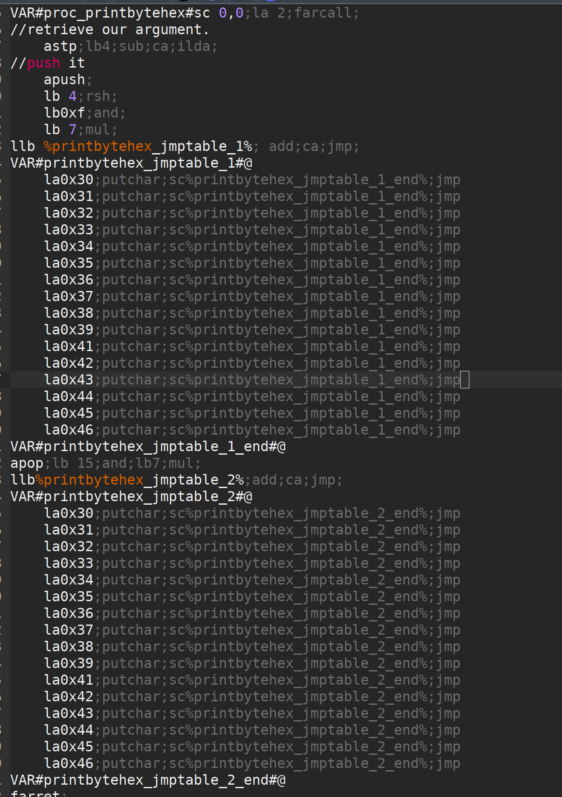
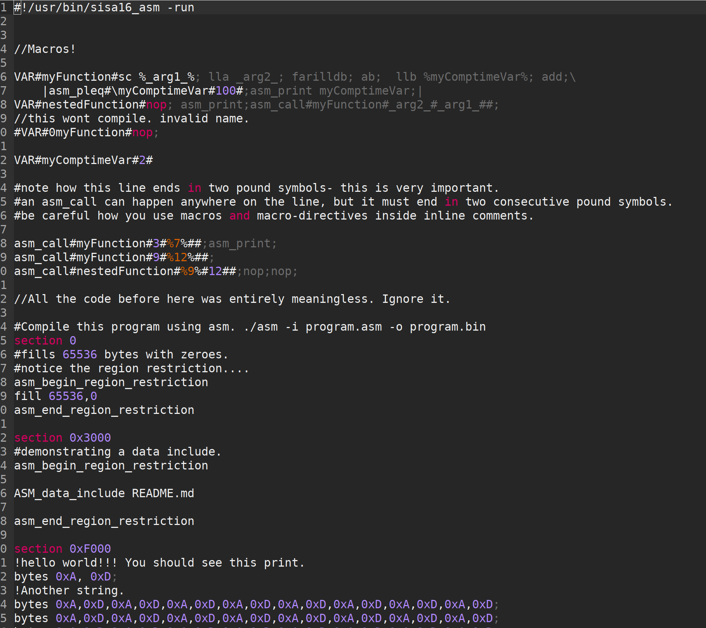
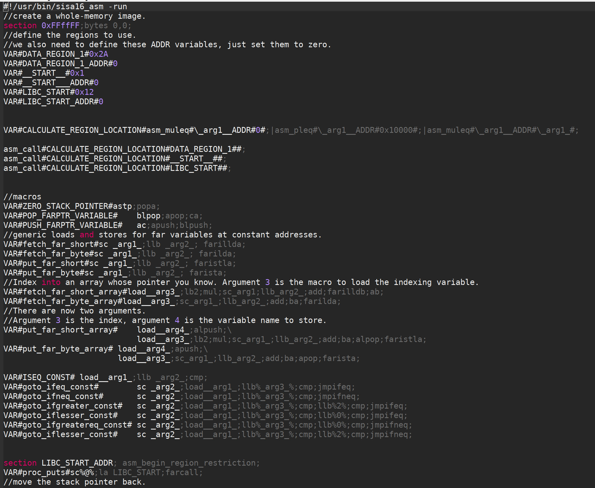
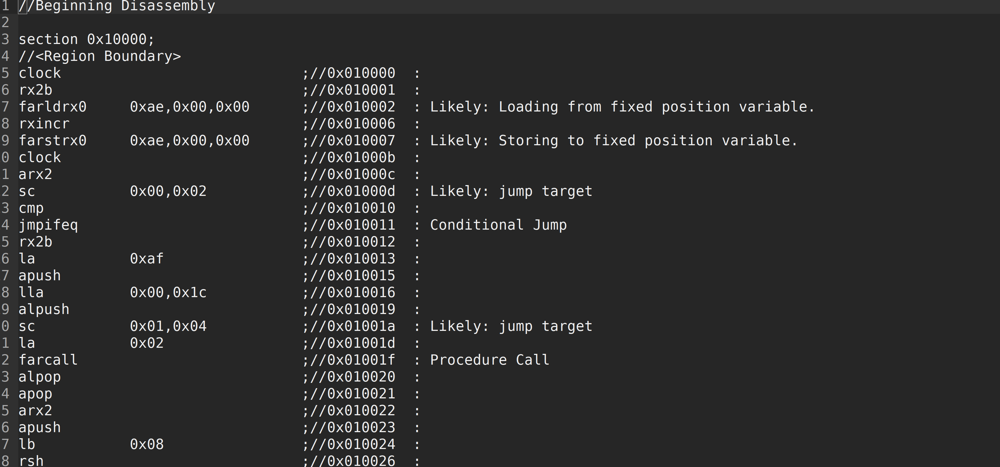
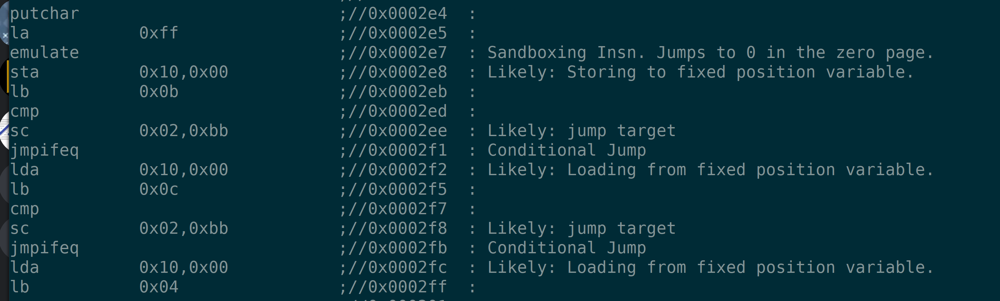
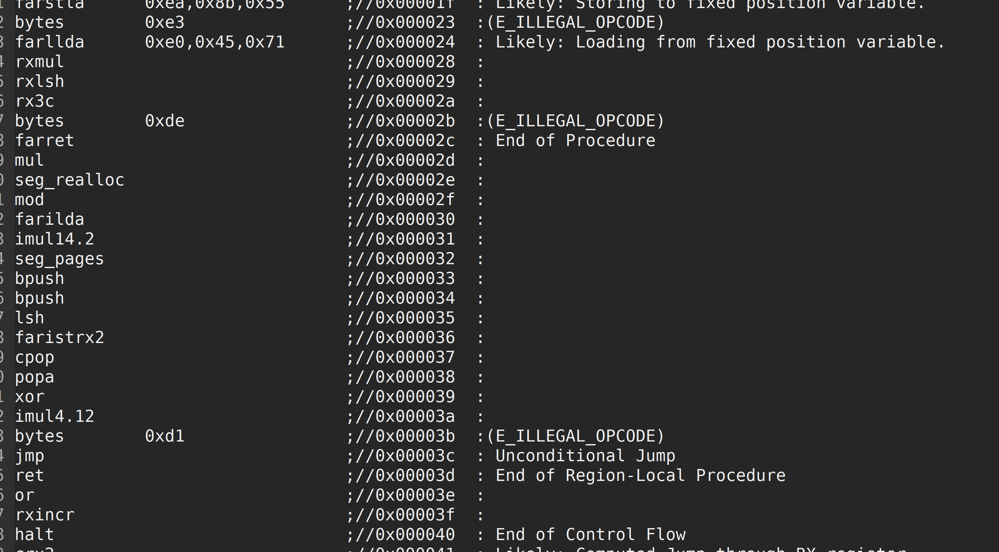

# Simple, Embeddable, Performant Virtual Machine Language

SISA16 is an extremely lightweight virtual machine designed to replace languages like Lua for program extension.

## Why is SISA16 special?

* Minimal dependence on the host operating system. A very minimal C standard library will build the assembler
	and emulator just fine.

* CPU architecture independence- With the exception of floating point arithmetic (And to a limited extent, signed integer division) all SISA16 operations are fully
	architecture independent. A softFP implementation is planned. 
	Fixed point arithmetic is provided as an alternative to floating point if needed, and
	signed integer division can be simulated in software if needed.

	The emulator and assembler are confirmed to work on many different architectures of varying endiannesses.

* Unique. SISA16 is no ordinary virtual machine. 
	it is self-sandboxing (Self-encapsulating, capable of creating Jails)

* Trivially embeddable. Implement five small and easy-to-understand functions in a single header file
	to add SISA16 scripting to any system.

* Ready for deployment. the assembler can build, execute, and disassemble binaries for debugging.

* Public domain. No IP attachments whatsoever. The only IP restriction on the entire repository is the
	Ncurses binding in d.h. There are 4 lines under the Ncurses license,
	which is a permissive free software license.
	If you want to have fully public-domain code,
	compile without Ncurses.

Build Statuses:

gek169/Simple_ISA:

Ubuntu (x86_64):


C-Chads/Simple_ISA:

Ubuntu (x86_64):


This repository contains the SISA16 standalone emulator source, 
the macro assembler/disassembler which doubles as an emulator,
and a C++ proof-of-concept of a compiletime instruction set simulator, which
inspired this project.

# What does the Assembly language look like?

a simple function which prints a byte's value as two hex-digits:



Advanced example with macros, demonstrating compiletime macro calling with asm_call:



Assembly-time computation of region offsets using macros to place a "libc" at 0x120000, as well as other macros.




A portion of a disassembled binary:



Another binary disassembled:



'/dev/urandom' disassembly:



# Notable Features and Limitations

* 'emulate' instruction which allows for sandboxed execution.

* Infinite 'segment' which allows for access to more than 16 megs of memory.

* the registers a, b, c, and the program counter are 16 bit. the program conter region is 8 bit.

* RX0-3 are 32 bit.

* No MOV instruction, SISA16 is a load/store RISC.

* 16 bit segmented memory model

* Single-threaded

* Roughly similar performance in the virtual machine with unoptimized or optimized builds of the VM.

# How portable?

The emulator and assembler have been compiled and tested on the following architectures and platforms:

```c
	IA32 (using: Debian linux, Alpine linux, on: native, jslinux)
	i536 (using: Debian linux, Alpine linux, on: native, jslinux)
	x86_64 (using: Debian linux, Windows 10, on: native)
	riscv64 (Buildroot linux, jslinux)
```

The included assembly programs are written for the architecture and can be executed just like scripts!

(the cpp file in this repository is a proof-of-concept unmaintained alpha version of this project.)

Here is how you use the emulator on a unix system:
```bash
#compile the emulator
#most systems have UNSIGNED_INT as four byte unsigned types, that's what the define is for.
cc isa.c -o sisa16_emu -DUSE_UNSIGNED_INT
#compile the assembler
cc assembler.c -o sisa16_asm -DUSE_UNSIGNED_INT
#assemble your program
./sisa16_asm -i program.asm -o program.bin
#run your program
./sisa16_emu program.bin
#install sisa16
sudo cp sisa16_asm /usr/bin/
sudo cp sisa16_emu /usr/bin/

#run asm program starting with shebang as script
#the shebang looks like this for the default INSTALL_DIR:
#!/usr/bin/sisa16_asm -run
#you put that at the top of your file and chmod+x the .asm file, and it will run.
./program.asm
```
On a windows machine, the compiled C programs would be EXEs rather than lacking an extension, but your
SISA16 programs should be binary compatible.

DuckDuckGo is your friend if you need to learn how to compile C programs on your target platform.

# How to install SISA16 on your machine.

On most unix-based machines:
```sh
make
#or su - and login, no sudo...
sudo make install
#to uninstall
sudo make uninstall
```

you `sudo make install` and `sudo make uninstall` to install sisa16 and sisa16_asm (with those names) into INSTALL_DIR 

you can set the INSTALL_DIR by using `make install INSTALL_DIR=/my/directory`

but make sure that while uninstalling you pass INSTALL_DIR again.

Alternatively, you can set INSTALL_DIR in the makefile yourself.

once you've installed the emulator and the assembler, you can quickly run assembly programs like this:

`sisa16_asm -run my_asm_file.asm`

if you want to use sisa16 assembler as a scripting language, you can add a hashbang to your files.

for the default INSTALL_DIR which is `/usr/bin`:

`#!/usr/bin/sisa16_asm -run`

The emulator and assembler are confirmed to compile *and run correctly* on linux with GCC, clang, and tinyc on
x86_64, x86, aarch64, riscv, and several other architectures.

Testing with the compcert compiler is planned.

The emulator has the best performance compiled with gcc at -Os.

The emulator itself has been confirmed to *compile* using compiler explorer on...

* Intel Cilk Compiler

* GCC and Clang on virtually every platform.

* MSVC

* a myriad of unusual and strange compilers on dozens of architectures.

Both the emulator and the assembler are c89 compliant.

I plan on making the assembler self-hosting at some point.

Terminology:
```
Address: Location where data is stored in main memory

Register: a very fast form of memory which is not part of main memory

Page: 256 bytes starting at an address whose low byte is zero.

Region: 64 kilobytes starting at an address whose 2 low bytes is zero.

Zero 'Home' or 'Stack' Region: the topmost region, where the stack pointer is stuck and where normal non-far loads and stores happen.

You can consider the home region to be "Scratchpad Memory"

Bus or Device: 
the implementation of gch() and pch() from d.h which is used for I/O and accessible with getchar/putchar
in the assembly language.

Segment: 
The additional region of memory outside the normal SISA16 address space, which is 
allocated at runtime, used for mass storage (the heap). Typically for loading files or extremely large structures,
but can also be used to hold code.
```
Supported instructions:
```
halt- end execution (1 byte) (0)
lda- load byte into register a,zero extend (3 bytes)(1)
la - set register a to value (2 bytes) (2)
ldb - load byte into register b, zero extend (3 bytes)(3)
lb - set register b to value (2 bytes) (4)
sc- load 2 constant bytes into c (3 bytes) (5)
sta- store a to location (3 bytes) (6)
stb- store b to location (3 bytes) (7)
add- a = a + b (1 byte) (8)
sub- a = a - b (1 byte) (9)
mul- a = a * b (1 byte) (A)
div- a = a / b (1 byte) (B)
mod- a = a % b (1 byte) (C)
cmp- if(a<b) a = 0; else if(a>b)a=2; else a=1; (1 byte) (D)
jmpifeq- set program counter to c if a == 1 (1 byte) (E)
jmpifneq- set program counter to c if a is not 1 (1  byte) (F)
getchar- read short from device. (Usually standard out) (1 byte) (10)
putchar- write register A as short to device (Usually standard out) (1 byte)(11)
and- a = a & b (1 byte)(12)
or- a = a | b (1 byte)(13)
xor- a = a ^ b (1 byte)(14)
lsh- a <<= b&7 (1 byte)(15)
rsh- a >>= b&7 (1 byte)(16)
ilda- a = read(c), indirectly access memory through register c and load it into a (1 byte)(17)
ildb- b = read(c), indirectly access memory through register c and load it into b (1 byte)(18)
cab- c = a<<8 + b, make c the combination of a and b. (1 byte)(19)
ab- a = b (1 byte)(1A)
ba- b = a (1 byte)(1B)
alc- a = low half of c (1 byte)(1C)
ahc- a = the high half of c (1 byte)(1D)
nop- (1byte) (1E)
cba c = b<<8 + a, make c the other combination of a and b. (1 byte) (1F)
~~16 bit ops
lla, Large Load 2 constant bytes into A (3 bytes)(20)
illda, a = [c], indirectly load 2 bytes into A through C (1 byte)(21)
llb, Large Load 2 constant bytes into B (3 bytes)(22)
illdb b = [c], indirectly load 2 bytes int B through C (1 byte)(23)
illdaa, a = [a] indirectly load 2 bytes into A through A (1 byte)(24)
illdbb, b = [b] indirectly load 2 bytes into B through B (1 byte)(25)
illdab, a = [b] indirectly load 2 bytes into A through B (1 byte)(26)
illdba, b = [a] indirectly load 2 bytes into B through A (1 byte)(27)
~~Moving to and from register c as shorts.
ca c=a (1 byte)(28)
cb c=b (1 byte)(29)
ac a=c (1 byte)(2A)
bc b=c (1 byte)(2B)

ista, [c] = a, (as byte) store a at the location pointed to by C (1 byte)(2C)
istb, [c] = b, (as byte) store b at the location pointed to by C (1 byte)(2D)
~~More 16 bit ops
istla, [c] = a, (as short) indirectly store large a at the location pointed to by C(1 byte)(2E)
istlb, [c] = b, (as short) indirectly store large b at the location pointed to by C(1 byte)(2F)

jmp, unconditionally jump to the location pointed to by c. (1 byte) (30)
stla, store large A at constant address (3 bytes) (31)
stlb, store large B at constant address (3 bytes) (32)
stc, store C at constant address (3 bytes) (33)
/*52 dec so far.*/
push, stp+=val, add to the stack pointer by a number of bytes (3 bytes) (34)
pop, stp-=val, subtract from the stack pointer by a number of bytes (3 bytes) (35)
pusha, stp+=a, add a to the stack pointer (1 byte) (36)
popa, stp-=a, sub a from the stack pointer (1 byte) (37)
astp, a = stp (1 byte) (38)
bstp, b = stp (1 byte) (39)

/*58 decimal so far.*/
compl, a = ~a (1 byte) (3A)
/*59 dec*/

cpc, c = the program counter. (1 byte) (3B)
call: (1 bytes)(3C)
write the program counter to the stack pointer. Push the stack pointer by 2. Jump to c.
ret: (1 byte)(3D)
subtract 2 from the stack pointer. load the program counter from the stack pointer.
farillda: load short using far memory indexing at [(u8)c<<16 + (u16)b] (1 byte) (3E)
faristla: store short into far memory indexing at [(u8)c<<16 + (u16)b] (1 byte) (3F)
farilldb: load short using far memory indexing at [(u8)c<<16 + (u16)a] (1 byte) (40)
faristlb: store short into far memory indexing at [(u8)c<<16 + (u16)a] (1 byte) (41)
NOTE: Page size is 256 bytes.
farpagel: copy 256 bytes from any page indexed by c to page indexed by a (1 byte) (42)
farpagest: copy 256 bytes to any page indexed by c from page indexed by a (1 byte) (43)

/*68 dec so far*/

//Far call procedure:

lfarpc: pp = a; pc=0; move the program counter offset to a different 64k region of memory. Set PC to 0. (1 byte) (44)
farcall: (1 byte) (45)
write the program counter to the stack pointer. 
Push the stack pointer by 2.
Write the program counter offset to the stack pointer. Set the program counter offset to a. Jump to c.
farret: (1 byte) (46)
Subtract 1 from the stack pointer, assign the program counter offset from the stack pointer.
subtract 2 from the stack pointer. load the program counter from the stack pointer. (jump)
farilda: load byte using far memory indexing at [(u8)c<<16 + (u16)b] (1 byte) (47)
farista: store byte into far memory indexing at [(u8)c<<16 + (u16)b] (1 byte) (48)
farildb: load byte using far memory indexing at [(u8)c<<16 + (u16)a] (1 byte) (49)
faristb: store byte into far memory indexing at [(u8)c<<16 + (u16)a] (1 byte) (4A)
/*75 dec so far.*/

FIXED POINT OPERATIONS: 16 multiply instructions. add and subtract carry over.
ranging from 4B to 5A. All 1 byte.
imul15.1: fixed-point multiply of a and b, 15.1
imul14.2: fixed-point multiply of a and b
imul13.3: fixed-point multiply of a and b
imul12.4: fixed-point multiply of a and b
imul11.5: fixed-point multiply of a and b
imul10.6: fixed-point multiply of a and b
imul9.7: fixed-point multiply of a and b
imul8.8: fixed-point multiply of a and b
imul7.9: fixed-point multiply of a and b
imul6.10: fixed-point multiply of a and b
imul5.11: fixed-point multiply of a and b
imul4.12: fixed-point multiply of a and b
imul3.13: fixed-point multiply of a and b
imul2.14: fixed-point multiply of a and b
imul1.15: fixed-point multiply of a and b
imul.16: fixed-point multiply of a and b
alpush: push short register a onto the stack. (1 byte) (5B)
blpush: push short register b onto the stack. (1 byte) (5C)
cpush: push short register c onto the stack. (1 byte) (5D)
apush: push byte register a onto the stack. (1 byte) (5E)
bpush: push byte register b onto the stack. (1 byte) (5F)

alpop: pop short register a from the stack. (1 byte) (60)
blpop: pop short register b from the stack. (1 byte) (61)
cpop: pop short register c from the stack. (1 byte) (62)
apop: pop byte register a from the stack. (1 byte) (63)
bpop: pop byte register b from the stack. (1 byte) (64)
interrupt: pass the registers to the user defined "interrupt" function (1 byte) (65)
clock: set register a to the execution time in thousandths of a second. (1 byte) (66)
Register B will be the time in seconds. 
C will be the raw number of clock cycles.
arx0: load RX0 into A. (1 byte) (67)
brx0: load RX0 into B. (1 byte) (68)
crx0: load RX0 into C. (1 byte) (69)
rx0a: load A into RX0. (1 byte) (6A)
rx0b: load B into RX0. (1 byte) (6B)
rx0c: load C into RX0. (1 byte) (6C)

arx1: load RX1 into A. (1 byte) (6D)
brx1: load RX1 into B. (1 byte) (6E)
crx1: load RX1 into C. (1 byte) (6F)
rx1a: load A into RX1. (1 byte) (70)
rx1b: load B into RX1. (1 byte) (71)
rx1c: load C into RX1. (1 byte) (72)

arx2: load RX2 into A. (1 byte) (73)
brx2: load RX2 into B. (1 byte) (74)
crx2: load RX2 into C. (1 byte) (75)
rx2a: load A into RX2. (1 byte) (76)
rx2b: load B into RX2. (1 byte) (77)
rx2c: load C into RX2. (1 byte) (78)

arx3: load RX3 into A. (1 byte) (79)
brx3: load RX3 into B. (1 byte) (7A)
crx3: load RX3 into C. (1 byte) (7B)
rx3a: load A into RX3. (1 byte) (7C)
rx3b: load B into RX3. (1 byte) (7D)
rx3c: load C into RX3. (1 byte) (7E)

rx0_1: RX0 = RX1; (1 byte) (7F)
rx0_2: RX0 = RX2; (1 byte) (80)
rx0_3: RX0 = RX3; (1 byte) (81)

rx1_0: RX1 = RX0; (1 byte) (82)
rx1_2: RX1 = RX2; (1 byte) (83)
rx1_3: RX1 = RX3; (1 byte) (84)

rx2_0: RX2 = RX0; (1 byte) (85)
rx2_1: RX2 = RX1; (1 byte) (86)
rx2_3: RX2 = RX3; (1 byte) (87)

rx3_0: RX3 = RX0; (1 byte) (88)
rx3_1: RX3 = RX1; (1 byte) (89)
rx3_2: RX3 = RX2; (1 byte) (8A)

lrx0: load 4 constant bytes (highest, high, low, lowest) into RX0. (5 bytes) (8B)
lrx1: load 4 constant bytes (highest, high, low, lowest) into RX1. (5 bytes) (8C)
lrx2: load 4 constant bytes (highest, high, low, lowest) into RX2. (5 bytes) (8D)
lrx3: load 4 constant bytes (highest, high, low, lowest) into RX3. (5 bytes) (8E)

farildrx0: load RX0 from memory location M[(c&255)<<16 + a] (1 byte) (8F)
farildrx1: load RX1 from memory location M[(c&255)<<16 + a] (1 byte) (90)
farildrx2: load RX2 from memory location M[(c&255)<<16 + a] (1 byte) (91)
farildrx3: load RX3 from memory location M[(c&255)<<16 + a] (1 byte) (92)

faristrx0: store RX0 at memory location M[(c&255)<<16 + a] (1 byte) (93)
faristrx1: store RX1 at memory location M[(c&255)<<16 + a] (1 byte) (94)
faristrx2: store RX2 at memory location M[(c&255)<<16 + a] (1 byte) (95)
faristrx3: store RX3 at memory location M[(c&255)<<16 + a] (1 byte) (96)

rxadd: RX0 += RX1;(1 byte) (97)
rxsub: RX0 -= RX1;(1 byte) (98)
rxmul: RX0 *= RX1;(1 byte) (99)
rxdiv: RX0 /= RX1;(1 byte) (9A)
rxmod: RX0 %= RX1;(1 byte) (9B)
rxrsh: RX0 >>= RX1;(1 byte) (9C)
rxlsh: RX0 <<= RX1;(1 byte) (9D)

rx0push: push 32 bit RX0 register onto the stack. (1 byte) (9E)
rx1push: push 32 bit RX1 register onto the stack. (1 byte) (9F)
rx2push: push 32 bit RX2 register onto the stack. (1 byte) (A0)
rx3push: push 32 bit RX3 register onto the stack. (1 byte) (A1)

rx0pop: pop 32 bit RX0 register from the stack. (1 byte) (A2)
rx1pop: pop 32 bit RX1 register from the stack. (1 byte) (A3)
rx2pop: pop 32 bit RX2 register from the stack. (1 byte) (A4)
rx3pop: pop 32 bit RX3 register from the stack. (1 byte) (A5)

rxand: RX0 &= RX1(1 byte) (A6)
rxor: RX0 |= RX1(1 byte) (A7)
rxxor: RX0 ^= RX1(1 byte) (bitwise XOR) (A8)
rxcompl: RX0 = ~RX0; bitwise inversion, 1's complement.(1 byte) (A9)
rxcmp:	if(RX0<RX1)a=0;else if(RX0>RX1)a=2;else a=1;  (1 byte) (AA)


seg_ld: load segment RX1 into page RX0 of Main Memory. (1 byte) (AB)
seg_st: store segment RX0 from main memory into page RX1 in the segment. (1 byte) (AC)
seg_realloc: resize the segment to size specified by RX0. if RX0 is 0, then an error flag is returned. (1 byte) (AD)

fltadd: floating point addition, RX0 += RX1, disabled with -DNO_FP (1 byte) (AE)

fltsub: (1 byte) (AF)

fltmul: (1 byte) (B0)

fltdiv: divide by zero is erroneous. (1 byte) (B1)

fltcmp: if(RX0<RX1)a=0;else if(RX0>RX1)a=2;else a=1;, but RX0 and RX1 are treated as floating point (1 byte) (B2)

seg_pages: get the number of pages in the segment in RX0. (1 byte) (B3)

ildrx0_1: indirectly load rx0 by using rx1. (1 byte) (B4)

ildrx0_0: indirectly load rx0 by using rx0. (1 byte) (B5)

farjmprx0: jump to location pointed to by rx0. (1 byte) (B6)

istrx0_1: store rx0 at the location pointed to by rx1. (1 byte) (B7)

istrx1_0: store rx1 at the location pointed to by rx0. (1 byte) (B8)

cbrx0: c = RX0>>16; b = RX0 & 0xffFF; (1 byte) (B9)

carx0: c = RX0>>16; a = RX0 & 0xffFF; (1 byte) (BA)

rxidiv: RX0 = (signed)RX0 / (signed)RX1 (1 byte) (BB)

rximod: RX0 = (signed)RX0 % (signed)RX1 (1 byte) (BC)

farldrx0: load RX0 from constant memory location (4 bytes) (BD)

farldrx1: (4 bytes) (BE)

farldrx2: (4 bytes) (BF)

farldrx3: (4 bytes) (C0)

farllda: (4 bytes) (C1)

farlldb: (4 bytes) (C2)

farldc: (4 bytes) (C3)

farstrx0: store rx0 to constant memory location (4 bytes) (C4)

farstrx1: (4 bytes) (C5)

farstrx2: (4 bytes) (C6)

farstrx3: (4 bytes) (C7)

farstla: (4 bytes) (C8)

farstlb: (4 bytes) (C9)

farstc: (4 bytes) (CA)

aincr: (1 byte) (CB)

adecr: (1 byte) (CC)

rxincr: (1 byte) (CD)

rxdecr: (1 byte) (CE)

emulate: Run a SISA16 sandboxed machine sharing the segment and a single page of choice according to register A (1 byte) (CF)
	Errors in the sandboxed machine are trapped and returned to register A.

	The segment is also sandboxed and a new 256 byte segment is allocated for the child program.
	
	the maximum recursion allowed by the implementation is defined by SISA16_MAX_RECURSION_DEPTH in isa_pre.h

rxitof: convert RX0 from signed int to float. (1 byte) (CF)

rxftoi: convert RX0 from float to signed int. (1 byte) (D0)

The rest: nop duplicates, free for expansion (1 byte)
```
There are plenty of free instruction spots for you to play around with in your experimentation.

The primary usecase for this is probably embedding a portable bytecode instruction set into a game,
or for educational purposes.

The emulator will print out its memory layout at the end of execution if you pass an additional argument
to it on the commandline (other than just the program name)
```bash
sisa16 program.bin literallyanything
```
## Device Interface

You can make the emulator work with any device you want by implementing your own abstraction layer.
Implement these functions in a d.h file:

void di() is the device initializer.
void dcl() is the devoice closing function.
unsigned short gch() is the "get" function which puts something into register a.
void pch(unsigned short) is the "put" function which gets something from register a.

the memory (`unsigned char M[(1<<24)];`) is accessible from these functions.

for more advanced usage which requires access to the registers...
```c
static unsigned short interrupt(unsigned short a,
								unsigned short b,
								unsigned short c,
								unsigned short stack_pointer,
								unsigned short program_counter,
								unsigned char program_counter_region,
								UU RX0,
								UU RX1,
								UU RX2,
								UU RX3
							);
```

The emulator requires a filename as the first parameter when running.

A reasonably competent assembler is included with the ability to define sections, 
include arbitrary data,
and write your own multi-statement macros.
It also does a limited amount of error checking.

The assembler can now perform disassembly if you give it a file and a location to disassemble from.

```sh
sudo make -B install
./asm_compile.sh
#and then...
sisa16_asm -dis clock.bin 0x20000
```

## What is this ISA called?

SISA16, Simple Instruction Set Architecture 16-bit.

## Specs?

The ISA is capable of indexing 64k of memory "normally" but by using "far" indexing, it can
access 16 megabytes in total.

You can use the included assembler to define ROMs which are up to the full 16 megabytes in size.

CPU speed:
The machine isn't real but it executes as fast as possible on the host machine.

Memory speed:
Again, not really simulated. The architecture is designed with cache-efficiency in-mind, though- hence
the existence of the home region and its special properties.

Floating point unit:
the only platform-dependent feature of the ISA.

you can disable the floating point unit by compiling isa.c with -DNO_FP

there will be no floating point code in the resulting binary.

## Portability

The Emulator and Assembler compile and run on dozens of architectures of varying endiannesses.

Compiletime and runtime checks on the environment are done to ensure that any platform that the ISA won't run on
are prevented from passing even the most basic testing.


## Far memory system.

Note that the program counter is 16 bit (not 32) and so the program counter cannot normally access
more than the first 64 kilobytes.

To get around this, I have implemented an "offset" system.

THere is a special register called the "program counter offset" which is set implicitly in farcall and farret,
or set explicitly with lfarpc.

It is recommended you put your procedure definitions on page boundaries so that they can be easily copied and called.
You might want to define a standard for how the number of pages a procedure occupies is specified-
for instance, if a procedure occupies three pages,
you might want to store a single byte before the beginning of the procedure specifying its length as three pages.

If you use the farcall/farret system, be warned: you cannot use normal loads and stores to access memory
outside the first 64k. This means for instance that if you write self-modifying code, you will not write
to the actual location of instructions being executed.

This can be useful- you can consider the first 64k "stack only" or "scratchpad memory"

jumps and calls that happen after a farcall or lfarpc will always jump within the
current 64k that the program counter is inside of.

the first 64k is typically the fastest to access on the emulator since it is closest to the registers.

Far memory loads and stores are now much easier with the farld and farst instructions and the indirect variants.

## Programming conventions established by hardware

Stack:

The stack pointer (which always resides in the first 64k) points to a *free* location on the stack.
The stack pointer *increments* rather than decrements to increase the stack size.

The stack can be, at most, 64 kilobytes. Don't let it get there.

## SISA-16 Assembler

the SISA-16 assembler is very basic but very powerful. you can define variables, include arbitrary data in multiple ways,
and of course, invoke every single one of SISA-16's many instructions.

The assembler is a two-pass compiler. The first pass behaves like the second pass but doesn't actually write
to the output file. On the second pass, the assembler writes to the output file.

This is done so that macros for goto labels can be generated on the first pass and used on the second-
if you have something like this:
```
sc %myLabel%;jmp;
#later...

VAR#myLabel#@
```
then on the first pass, the split `%myLabel%` will be evaluated as zero on the first pass, but on the second pass,
the value will be used.

The assembler allows you to define macros like this
```
VAR#myVariableName# my variable definition
```
If the variable definition contains `$` or `@` then 
they will be expanded before macro definition. This allows you to define goto labels, for instance.

Anywhere where "myVariableName" is encountered from then-on in the source code (including in the second pass) will be
expanded.

Note that you can create infinitely recursive macros.
Is that a bug or a feature?
my answer is YES to both, and i'm sure clever programmers will come up with ways to abuse macro recursion

I'm also extremely confident that you could somehow cause the second pass to be out-of-sync with the first pass
by abusing macro recursion. You can fix such bugs yourself by using asm_fix_outputcounter in a pinch.

Really, you should figure out why it's happening.

The assembler will generate warnings for most situations that would warrant it:
* a split directive evaluates to zero on the second pass. (You could have just written "0,0" , it is most likely a misspelled variable)
* an inline comment invalidates the rest of a line (Just a warning)
* fill tag is set to zero when not explicitly declared as zero (the statement will do nothing)
* section tag is set to zero when not explicitly declared as zero (the statement moves the outputcounter to the beginning of the output file)
* Confirmed macro desync between passes
* Unusual characters before an instruction's name (Usually leads to an unrecoverable error.)

The assembler will generate unrecoverable errors for most situations that would warrant it:
* An unknown name is parsed as a statement (Usually meaning you misspelled a macro name...)
* An invalid number of arguments is provided for an instruction or directive
* The bounds check for a region restriction or page/block restriction fails. This is useful when you want to
make sure that a subroutine fits inside of a memory region or page (64k or 256 bytes, aligned, respectively) or that
a piece of data which will be accessed as an array can be indexed "normally" using 16 bit math.
* a macro definition uses a reserved name, like an instruction name or anything beginning with ASM_ or asm_
* a macro definition would trample or redefine a built-in macro or reserved name. You cannot define "ll" for instance,
	because it would make "llb" and "lla" and "illdaa" unusable, but you can define "myll" because it would not trample any of those.
* a file is included that is larger than the entire SISA-16 address space.
* a file is included that is empty
* you attempt to define a string literal anywhere other than the start of a line.
* asm_quit was invoked on the second pass.
* an unreachable or unopenable file is included with ASM_data_include

### list of SISA-16 assembler reserved words
```
	<all the instruction names are reserved. See above.>
	asm_print- if on the second pass, print the output counter, the line, and the line post-processing.
	asm_quit- if on the second pass, stop assembly.
	asm_vars- print all variables on both passes.
	asm_fix_outputcounter- if you have a desync issue between the two passes of the assembler and 
		you don't know how to fix it, you can correct it with this. Moves the output counter on the second pass only.
	section- move the output counter to a location.
	fill- fill an area of memory with a constant byte value.
	ASM_*- reserved namespace
	asm_*- reserved namespace
	VAR#- define a macro with syntax VAR#name#definition. VAR# must be at the beginning of a line.
	asm_call- call a macro with arguments. asm_call#mymacro#firstarg#secondarg##;
		may be inline, you can invoke asm_call multiple times.
		If during macro expansion on a non-macro line, an asm_call appears which did not exist before, then it is processed.
	asm_pleq- perform addition on macros. 
		Syntax;
		asm_pleq#\macroname1#\macroname2#; OR asm_pleq#\macroname1#integerliteral#;
		if macroname1 is a string containing an integer literal, it will be replaced with the string
		resulting from the parsing of the integer literal of strtol(macroname1) + strtol(macroname2)
		or, for the integer literal caase,
		strtol(macroname1) + strtol("integerliteral").

		if you perform a pleq then all statements after it (even on the same line) will see the macro as being that value.

		Note that because pleq is a *pre-pre processor instruction* all macro evaluations of a the variable on the line
		will be the last value calculated. if you do
		sc %myvar%; asm_pleq#myvar#3#;
		where myvar is zero on the line before it is added to, 
		then you will not get the expected result,
		sc %0%; myvar+=3;
		you will instead get...
		myvar += 3; sc %3%;

		You can use | to get the expected macro evaluation order.
	asm_muleq- identical to asm_pleq but for multiplication.
	\- Escape character. Prevent macro expansion for following macro. Needed to pass macro names to asm_pleq and asm_muleq,
		otherwise they would be expanded.
		if this is present at the end of a line, regardless of what kind of line it is,
		the next line will be included with this one and treated as a single line, as if there were no gaps.

		the backslash at the end of the line will be eliminated.
	|- Macro evaluation sequence point operator. the line will be fully macro-expanded before this point, including
		all pre-processing. The vertical bar will then be replaced with a semicolon.
	!- string literal line. Must start at the beginning of a line.
	$- expands to the current position of the output counter as an unsigned short, but split into two bytes.
		if the output counter is at 0xe9f2 then $ will evaluate to '233,242'. Note that the output counter
		position is determined at the beginning of the current line. Also note that if the output counter
		is greater than 64k, the upper byte will be ignored- effectively trapping $ to the home region.
		you can also specify an amount to be added to the $ value with $+value+, where value is an integer literal (Not a macro)
	@- expands to the current position of the output counter as a 24 bit unsigned integer. 
		Useful for section tags and fills and such. Has the same + syntax. Note that you *cannot* do %@%.
	%- two of these defines a split directive. %0xff0A% will be split into 255,10.
		Additionally, if you have a 32 bit value you wish to be split into four bytes (highest, high, low, lowest)
		then you can do %/myvalue% (with a forward slash) to get a 32 bit integer, or %?myvalue% to get a float, or %&myvalue% to get a 24 bit integer.
		All of these are unsigned.
	ASM_data_include- include a file as raw bytes in the output. Macros are not expanded on the line.
	bytes- include arbitrary bytes in the output file, 8 bit unsigned integers.
	shorts- include arbitrary pairs of bytes in the output file, 16 bit unsigned integers. Do not split the integers.
	" "- space macro, used to remove whitespace.
	"\t"- tab macro, used to remove tabs.
	asm_begin_region_restriction- record the current region of the output counter and emit an assemblytime error
		if an attempt to write bytes outside that region is made before an end tag.
	asm_begin_block_restriction- same as asm_begin_page_restriction
	asm_begin_page_restriction- record the current page of the output counter and emit an assemblytime error
		if an attempt to write bytes outside that page is made before an end tag.
		Note that setting a page restriction causes the current region restriction to be forgotten.
	asm_end_region_restriction- same as asm_end_page_restriction.
	asm_end_block_restriction- same as asm_end_page_restriction.
	asm_end_page_restriction- End the current restriction, do not emit errors.
```
### How to use the SISA-16 assembler

The assembler is compiled as `sisa16_asm` by default on a *nix machine.
you can invoke the assembler on a source file `source.asm` and create `source.bin` like this:

`sisa16_asm -i source.asm -o source.bin`

if you are editting or debugging the assembler itself, you may find it useful to
view extended debug output, or use stdin as the input file. you can use -DBG as an argument to the assembler for this.

Note that the two passes *won't work* in stdin mode. 

stdin mode is used if an input file is not specified and is solely for quickly debugging the assembler itself.

if you have bash on your system, or another compatible shell with typical core utils, then note that
any and all `.asm` files will be compiled and output to `.bin` files of the same name if they are placed
in the top level directory of this project when you invoke `make`, thanks to `asm_compile.sh`

if you wish to verify that the assembler generated the output you expected, you can view the output with 
`sisa16_asm -dis <file.bin> <location>`

this will show you the full disassembly.

### Static Linking

There are two ways of doing static linking: Headers and Precompilation.

Headers are the more intuitive and probably more extensible way.

to use headers, simply make a line that looks like this
```c
ASM_header myfile.asm
```
Note that this line is whitespace sensitive- the line must begin with `ASM_header ` (with one space).

the end of the line is at the newline character, and all spaces and characters after `ASM_header ` are considered
part of the filename.

If a relative path is used for the filename it will be searched for in the following locations, in order:
* current working directory.
* getenv("SISA16BIN")/
* /usr/include/
* ~/sisa16/
* C:\SISA16\

upon finding one successfully, it will open it.

Through intelligent use of the assembler to compile libraries before programs that use them, one can achieve
static linking by using `ASM_data_include ` (same semantics as ASM_header) 
and then creating macros to call functions defined in the file included,
or macros to refer to variables which are instantiated and used inside the library.

```c
#you have some library written as myLibrary.asm, which is used by myProgram.asm.
sisa16_asm -i myLibrary.asm -o myLibrary.bin
sisa16_asm -i myProgram.asm -o myProgram.bin

#in myProgram.asm...
section 0xee0000
asm_begin_region_restriction;
ASM_data_include myLibrary.bin
asm_end_region_restriction;

#Note that ASM_data_include does not change where the code you are including
#decides to put its variables or subroutines- the assembler just sees bytes- you must be careful about that.

#You have a subroutine called "LibPrint" defined in your library which is at 0xff90 in the library.
VAR#procLibPrint#la0xee;sc%0xff90%;farcall;
#Your library defines a short variable "LibVar" at 0xb102a4 which you need to interact with.
VAR#accessLibVar#sc %0xb1%;llb %0x02a4%
VAR#getshrtLibVar#accessLibVar;farillda;alpush;
VAR#putshrtLibVar#accessLibVar;alpop;faristla;
```

### Integer literals
Integer literals are default evaluated as decimal, like any other programming language,
but by prefixing them with `0` (zero) you can make them be interpreted as octal, or `0x` (zero, lowercase x) to be interpreted as hexadecimal.

### Macro evaluation order and macro evaluation bugs
Macros are evaluated in the order of most recently defined to first defined.

First defined macros include the builtin macros such as $, @, the space, and the percent directive.

Builtin macros *except for %, space, and tab* are parsed on macro lines.
### Use as a scripting language
the assembler can immediately execute an image instead of writing it to an output file.

This is actually much faster than normal assembly as it isn't constantly adjusting the file pointer with fseek.

### Use as an embedded language for program extension

You can embed SISA16 by implementing a host program that operates through the device driver. 
di, dcl, interrupt, gch and pch.

Simply take control of the program when di is invoked, eventually return to sisa16,
and use an interrupt from the assembly language to hand
control back to your C code from SISA16. This is known as "cooperative multitasking."

Use dcl() to close your driver's resources.

### Tips for doing stuff

If you've written x86 or any other assembly language for a machine with lots of registers, you may find SISA-16 very limiting.

You may also find it particularly annoying that complete pointer arithmetic is impossible.

I'd argue this is part of the charm, it's like a supped-up 8 bit micro. Here's some tips:

1) Establish an ABI convention. is the b register preserved through a function call, for instance? How are function arguments and return values passed?
2) Write macros for your variables and functions. you can use asm_call to do very fancy tricks!
3) Write macros which use other macros. Macros inside of a macro are not expanded until they are used (With the exception of built-ins like $ and %)
4) create inline subroutines using macros so you don't have to dedicate brainpower to indexing into an array.
5) Align all arrays to page or region boundaries- you can use `section` to move the output counter to a designated location.
6) use asm_begin_region_restriction and asm_end_region_restriction or page equivalents for arrays.
7) Do not try to be too clever with extremely recursive macros and the two passes- this is a very simple assembler and
you will very easily find ways to break it.
8) Know the limitations of the implementation. 
9) If you have a prebuilt library which must be placed at a particular location in the binary, you should specify that in the name!
	I would recommend region-aligning all libraries, unless they are extremely small.
```
Written by
~~~DMHSW~~~
for the public domain
```
