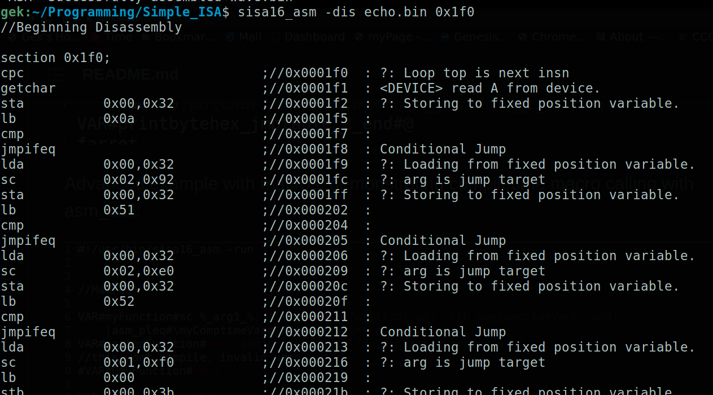

# A miniscule virtual machine language

SISA16 is an extremely lightweight high-performance minimal virtual machine designed not only
to replace languages like Lua and WebAssembly for program extension, but also to provide a common
high-performance computing platform on new architectures.

In this repository i have provided the assembler, emulator, disassembler, debugger, and an example kernel and standard library.

The assembler has the emulator built-in so that programs can be executed as scripts.

Platforms Tested and confirmed for 100% compliance:

```
	Windows 10 x86_64 (i7-6700) on MSYS2
	Windows 10 x86_64 (i7-6700) on WSL2
	Debian 11 x86_64 (i7-6700)
	Raspbian ArmV8 (BCM2837B0)
	Debian 11 IA32 (i7-6700)
	Alpine Linux IA32 (JSlinux)
	Buildroot Linux Riscv64 (JSLinux)
```

Platforms planned to be tested:

```
	Debian ppc32
	(any) ppc64
	(any) ppc64le
	(any) Mips64el
	(any) Mips64be
	(any) Mips64le
	Sega Naomi Hitachi Sh-4
```

## Why is SISA16 special?

* Minimal dependence on the host operating system. A very minimal C standard library will build the assembler
	and emulator just fine.

* CPU architecture independence- The behavior of the VM is host-independent. There are only two behaviors which may vary by architecture:
	* Floating point numbers. Their layout in memory may vary, although IEEE-754 compliance is nearly ubiquitous...

	* Signed integers. Non-twos-complement architectures are not supported, and the sign bit must be the highest bit.

	(Luckily, virtually every architecture around today guarantees both of these things.)

	* Execution time. Slower processors run code slower.

	The emulator and assembler are confirmed to work on literally dozens of architectures and operating systems.

* Unique. SISA16 is no ordinary virtual machine language...

	* Privileged- Has a "privileged" and "user" mode, with privileged and unprivileged instructions.

	* Tiny- Less than 400 kilobytes for a full emulator, assembler, and debugger toolchain! The standard library fits in less than 64k.

	* Hackable- More instructions can be added at a whim. Compiler flags allow for altering the emulator's behavior.

	* Fast. Gets about a billion instructions per second on a 4 ghz processor.

* Trivially embeddable. Implement five small and easy-to-understand functions in a single header file
	to add SISA16 scripting to any system.

* Ready for deployment. Assembler, Debugger, Disassembler, Kernel, manuals. Everything is here.

* Documented. Manpages and developer manual are provided in this repository along with examples.

* Public domain. 

Build Statuses:

gek169/Simple_ISA:

Ubuntu (x86_64):


C-Chads/Simple_ISA:

Ubuntu (x86_64):


This repository contains the SISA16 standalone emulator source, 
the macro assembler/disassembler which doubles as an emulator,

# What does the Assembly language look like?

See the included programs. they are named ".asm"

header libraries are postfixed with ".hasm"

precompiled libraries are postfixed ".bin"

The disassembly looks like this:




# Notable Features and Limitations

* Two privilege rings 

* the registers a, b, c, and the program counter are 16 bit. the program counter region is 8 bit.

* RX0-3 are 32 bit.

* No MOV instruction, SISA16 is a load/store RISC.

* 16 bit segmented memory model

* Single-threaded

* Roughly similar performance in the virtual machine with unoptimized or optimized builds of the VM.

* Uses computed goto on supported compilers, define USE_COMPUTED_GOTO

# Why?

Code written for Sisa16 is not only infinitely portable and fairly fast, but can easily be translated into any programming
language.

Read the documentation for more information.

sisa16_asm.1

Manual.pdf

```
Written by
~~~DMHSW~~~
for the public domain
~~~~~~~~~~~~~~~~~~~~~~~~~~~~~~~~~~~~~~~~~
~~Let all that you do be done with love~~
~~~~~~~~~~~~~~~~~~~~~~~~~~~~~~~~~~~~~~~~~

```
